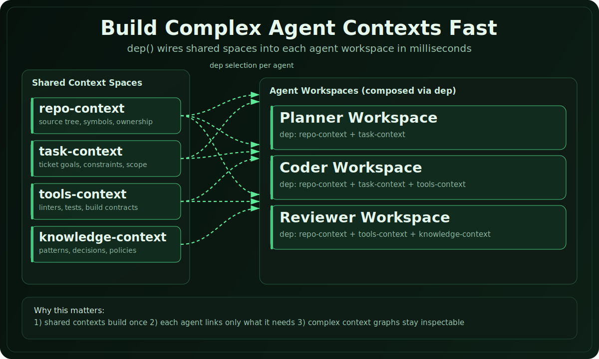

<p align="center">
  
</p>

<h1 align="center">radium-fs</h1>

<p align="center">
  <a href="./README.md">English</a> · <a href="./README.zh-CN.md">简体中文</a>
</p>

<p align="center">
  面向多 agent 系统的文件系统级上下文组合引擎。
</p>

<p align="center">
  
</p>

## radium-fs 是什么？

radium-fs 管理一组持久化的文件系统空间（space）。每个 space 都是一个真实目录，并且拥有确定性身份：相同配方、相同输入、相同结果。这些 space 通过符号链接形成依赖图，实现零拷贝复用，并可按需重建。

**为什么重要：** 复杂多 agent 系统需要高效共享、组合、复用上下文产物。radium-fs 提供统一基础设施层：一次构建、长期复用、毫秒级连接、按依赖路径精确重建。

文档入口：[English Docs](https://radium-fs.github.io/radium-fs/docs) · [中文文档](https://radium-fs.github.io/radium-fs/zh/docs)

### 核心特性

- **确定性** — `kind + input → dataId`。相同输入始终得到相同路径的 space。
- **可组合** — 使用 `dep()` 声明依赖，符号链接在毫秒级完成挂载，零拷贝。
- **可恢复** — 删除任意 space 后可按配方自动重建，依赖路径自动级联。
- **物理可见** — 每个 space 都是实际目录，可直接用 grep/find/rg/IDE。
- **运行时无关** — 核心层无平台绑定，JavaScript 可运行的地方都能用。

### 磁盘上的样子

```
.radium-fs-data/
├── lib/
│   └── a3/
│       └── a3f2c18e…/                    ← kind:lib + {name:"utils"}
│           ├── .radium-fs-manifest.json
│           └── space/
│               └── index.js
│
├── config/
│   └── 9d/
│       └── 9d4e7b01…/                    ← kind:config + {env:"prod"}
│           ├── .radium-fs-manifest.json
│           └── space/
│               └── settings.json
│
└── app/
    └── 7b/
        └── 7b9e4d5f…/                    ← kind:app + {name:"web"}
            ├── .radium-fs-manifest.json
            └── space/
                ├── main.js
                ├── lib → ../../../lib/a3/a3f2c18e…/space/      ← symlink
                └── config → ../../../config/9d/9d4e7b01…/space/ ← symlink
```

每个 space 都是**真实目录**，并且路径**可确定**（kind → shard → hash）。依赖使用**符号链接**连接：不重复存储、连接瞬时完成、任意本地工具都能直接使用。

### 快速示例

```typescript
import { defineKind, createStore } from '@radium-fs/core';
import { nodeAdapter } from '@radium-fs/node';

const lib = defineKind({
  kind: 'lib',
  async onInit({ input, space }) {
    await space.writeFile('index.js', `export const name = "${input.name}";`);
  },
});

const app = defineKind({
  kind: 'app',
  async onInit({ input, space }) {
    const libPath = await space.dep('lib', lib, { name: 'utils' });
    await space.writeFile('main.js', `import { name } from "${libPath}";`);
  },
});

const store = createStore({ root: '/project', adapter: nodeAdapter() });
const appSpace = await store.ensure(app, {});
// appSpace.path → /project/.radium-fs-data/app/7b/7b9e4d5f…
```

## 包列表

| 包名 | 说明 |
|---------|-------------|
| `@radium-fs/core` | 运行时无关核心引擎（defineKind、createStore、types） |
| `@radium-fs/node` | Node.js 文件系统适配器（要求 Node.js >= 22） |
| `@radium-fs/memory` | 内存适配器（浏览器 + Node.js） |

## 状态

核心引擎、Node.js 适配器与内存适配器均已实现。可参考 `examples/node-basic/` 运行示例。

## License

[MIT](LICENSE)
